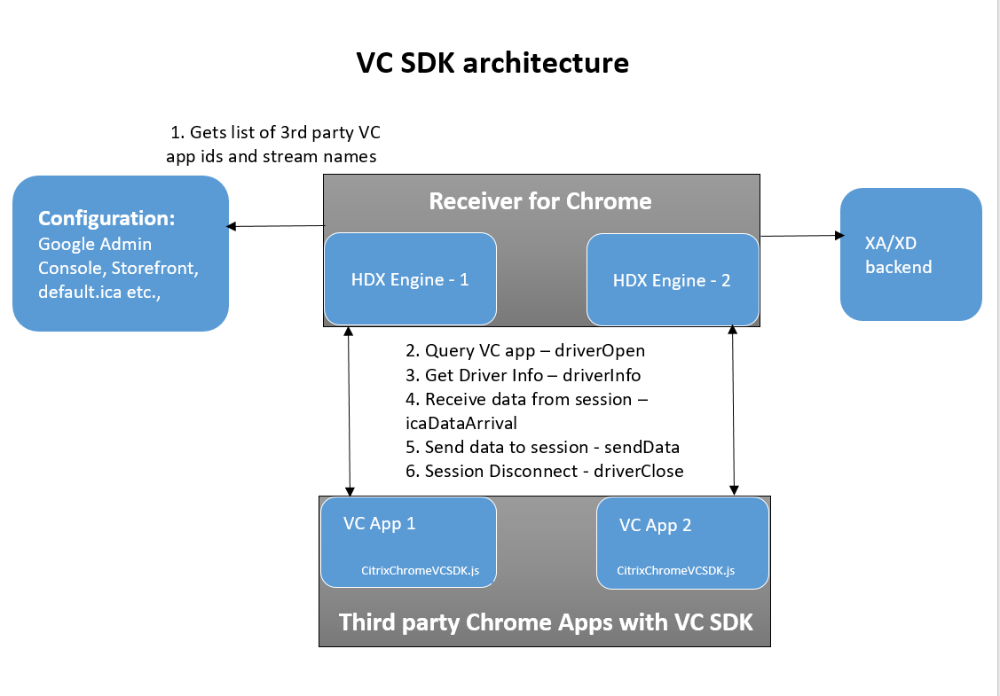

# System requirements

Third-party Chrome app must be implemented to add a new virtual channel. Virtual Channel SDK is a JavaScript file that should be included in the third-party Chrome app preferably in the background page. Adding the Virtual Channel SDK in the background page ensures that the Virtual Channel is added to the session regardless of the third-party Chrome app running or not. If virtual channel SDK is added as a part of non-background window, then virtual channel connection is established only when that window is active. 

Up to three client side virtual channels are supported where the virtual channel implementation of each virtual channel might be part of the same third-party Chrome app or different app.

IDs of all the third-party Chrome apps and the virtual channel stream name must be set in the Workspace app for Chrome configuration before launch of a session. 

You can use any supported configuration methods. However, Citrix recommends you to use Google Admin Console.  Third-party Chrome app must register the custom virtual channel using the Virtual Channel SDK before launching a HDX app/desktop sessions. Otherwise, the custom virtual channel is not initialized with the launched session. For more details, see [Programming Guide](./programming-guide.md).

## Execution Environment Requirements

### Server requirement

The Workspace app for Chrome Virtual Channel SDK is supported on Citrix XenApp 6.5 (and later) and Citrix XenDesktop 7.6 (and later).

### Client requirement

Citrix Workspace app for Chrome 2.5 and later

### Architecture

A Citrix Independent Computing Architecture (ICA) virtual channel is a bidirectional, error-free connection for the exchange of generalized packet data between a server running Citrix XenApp or XenDesktop, and a client device. You can use virtual channels to add functionality to clients. Uses for virtual channels include:

* Support for administrative functions
* New data streams (audio and video)
* New devices, such as scanners, card readers, and joysticks

### Virtual Channel Overview

An ICA virtual channel is a bidirectional, error-free connection for the exchange of generalized packet data between a client and a server running XenApp or XenDesktop. Each implementation of an ICA virtual channel consists of two components:

### Server-side portion on the computer running XenApp or XenDesktop

The virtual channel on the server side is a normal Win32 process. It can be an application or a Windows NT service.

### Client-side 

The client side custom virtual driver executes in the context of the client. You must implement the virtual driver by including virtual channel SDK JavaScript file in the Chrome packaged app. When you configure Citrix Workspace app for Chrome using the Chrome packaged app id and the virtual channel name, Citrix Workspace app for Chrome communicates with the Chrome packaged app by sending messages with the help of SDK and calls the appropriate callbacks provided at the time of registering the virtual channel. The Chrome packaged app must be installed and the virtual channel must be registered before launching a Citrix Workspace app for Chrome session.

You can either have different Chrome packaged app for each virtual channel or one Chrome packaged app with all the virtual channel implementation. Each virtual channel should register separately in your Chrome packaged app and Workspace app for Chrome should be configured accordingly.

This figure illustrates the virtual channel client-server connection:

Citrix Workspace app for Chrome Virtual Channel SDK is responsible for de-multiplexing the virtual channel data from the ICA data stream and routing it to the correct callback of the registered virtual channel. It is also responsible for sending the data using the appropriate object to the server in coordination with the Citrix Workspace app for Chrome. Citrix Workspace app for Chrome does not know any data package detail for each virtual channel and it only transfers all available data between the server and the client virtual driver.

The following is an overview of the client-server data exchange using a virtual channel:

1.	The client connects to the server running XenApp or XenDesktop. The client passes information about the virtual channels that it supports to the server.
2.	The server-side application starts, obtains a handle to the virtual channel, and optionally queries for additional information about the channel.
3.	Both the client-side virtual driver and server-side application can send data initiatively:
	4. If the server application has data to send to the client, the data is sent to the client immediately. When the client receives the data, Citrix Workspace app for Chrome de-multiplexes the virtual channel data from the ICA stream and passes to the third-party Chrome app implementing the virtual channel. Virtual Channel SDK routes the data to the appropriate callback of the registered object for that Virtual channel.
	5. If the client virtual driver has data to send to the server, the data is also sent immediately.
4.	When the ICA session disconnects or something unexpected occurs, such as runtime exceptions or errors, the virtual channel closes and the client virtual driver (third-party Chrome app) disconnects from Citrix Workspace app for Chrome.

### ICA and Virtual Channel Data Packets

Virtual channel data packets are encapsulated in the ICA stream between the client and the server. Because ICA is a presentation-level protocol and runs over several different transports, the virtual channel API enables you to write your protocols without worrying about the underlying transport. The data packet is preserved.

For example, if 100 bytes are sent to the server, the same 100 bytes are received by the server when the virtual channel is demultiplexed from the ICA data stream. The compiled code runs independently of the currently configured transport protocol.
The ICA engine provides the following services to the virtual channel:

### Packet encapsulation

ICA virtual channels are packet-based, meaning that if one side performs a write with a certain amount of data, the other side receives the entire block of data when it performs a read. This contrasts with TCP, for example, which is stream-based and requires a higher-level protocol to parse out packet boundaries. Stated another way, virtual channel packets are contained within the ICA stream, which is managed separately by the system software.

### Error correction

ICA provides its own reliability mechanisms even when the underlying transport is unreliable. This guarantees that connections are error-free and that data is received in the order in which it is sent.

### Workspace app and Virtual Driver Interaction

In Citrix Workspace app for Chrome, the custom virtual driver is implemented as a third-party Chrome packaged app and must be installed on the Chrome device before an ICA session is launched. Third-party Chrome packaged app needs to include the Virtual Channel SDK JavaScript file and register to the Virtual Channel by giving appropriate parameters. In addition, the third-party Chrome app implementing the virtual channel and the name of the virtual channel has to be configured for Citrix Workspace app for Chrome to bind. When you launch an ICA session, Citrix Workspace app for Chrome queries each Virtual Channel by sending messages to the third-party Chrome app. SDK calls the functions registered for different messages and the third-party Chrome app needs to respond with the replies in the format defined. If the third-party Chrome app is not installed or the Virtual Channel is not registered with the SDK or the Citrix Workspace app for Chrome is not configured correctly, then the Virtual Channel is not initialized but the sessions would be launched. 

As a note the virtual driver that you write must never block or perform time-consuming tasks in the driver operations like open, get info, ICA data arrival.
For more information about building Chrome packaged app, see the Chrome developer documentation.

The following process occurs when a user starts a session (Following happens for each session and for each virtual channel registered):

1.	On a session launch, using the configuration the app ids and the stream names are fetched. This is used by the session for binding the Virtual Channel between the third-party Chrome app and Citrix Workspace app for Chrome session.
2.	Session sends a message when the virtual channel is initialized to the third-party Chrome app. The Virtual Channel SDK handles the message and calls the callback set for the `driverOpen` during virtual channel registration by giving session Id and stream name. Callback present in the third-party Chrome app must reply with enable flag set to `true` or `false` along with the `sessionId` and the virtual channel name. If enable is set to `true`, further initialization of the virtual channel happens. Otherwise the virtual channel is ignored. If the virtual channel is not registered with SDK then the virtual channel is ignored.
3.	On sending enable `true`, session would send another message to collect the virtual channel information that must be sent to server during initialization. SDK would get the message and call the callback registered for driver info of the registered vc object. Callback present in third-party Chrome app must reply with the appropriate packet if applicable or reply with null.
4.	Session would send all the capabilities to the server and on successful initialization of virtual channel any data sent by server to Citrix Workspace app for Chrome session is forwarded to the Virtual Channel SDK.  Virtual Channel SDK calls the `icaDataArrival` callback of the registered virtual channel object. Callback should parse the packet and send the reply packet using `sendData` method of the registered virtual channel object. Utils has been provided to make packet reading and construction of reply packet easier.
5.	On disconnect of the session or the reload/crash/uninstall of the third-party Chrome app Virtual Channel SDK calls the `driverClose` callback of the third-party Chrome app with appropriate session Id and stream name. Can be used to handle any cleanup of the virtual channel for that session. 

### See also

* For sample example, see the [download](https://www.citrix.com/downloads/citrix-receiver/virtual-channel-sdks/virtual-channel-sdk.html) page.
* For details on signature and usage of APIs, see the [Programming Guide](./programming-guide.md). 

### Virtual Channel Packets

ICA does not define the contents of a virtual channel packet. The contents are specific to the particular virtual channel and are not interpreted or managed by the ICA data stream manager. You must develop your own protocol for the virtual channel data.

A virtual channel packet can be any length up to the maximum size supported by the ICA connection. This size is independent of size restrictions on the lower-layer transport. These restrictions affect the server-side WFVirtualChannelRead and WFVirtualChannelWrite functions and sendData callback on the client side. The maximum packet size is 5000 bytes (4996 data bytes plus 4 bytes of packet overhead generated by the ICA datastream manager).

Because Citrix Workspace app for Chrome and the Virtual Channel SDK for Chrome are not aware of the details of the virtual channel package, they pass all available data in the ICA stream to the virtual driver by calling `icaDataArrival`. Packets received by the icaDataArrival function of the virtual channel are Uint8Arrays with appropriate details of offset and length. The virtual channel also needs to send the data to server in the same format. 
The session creates a port connection using Chrome APIs and the data is sent/received over this port. Maximum size of the data that can be sent/received is dependent on the Chrome OS implementation.

